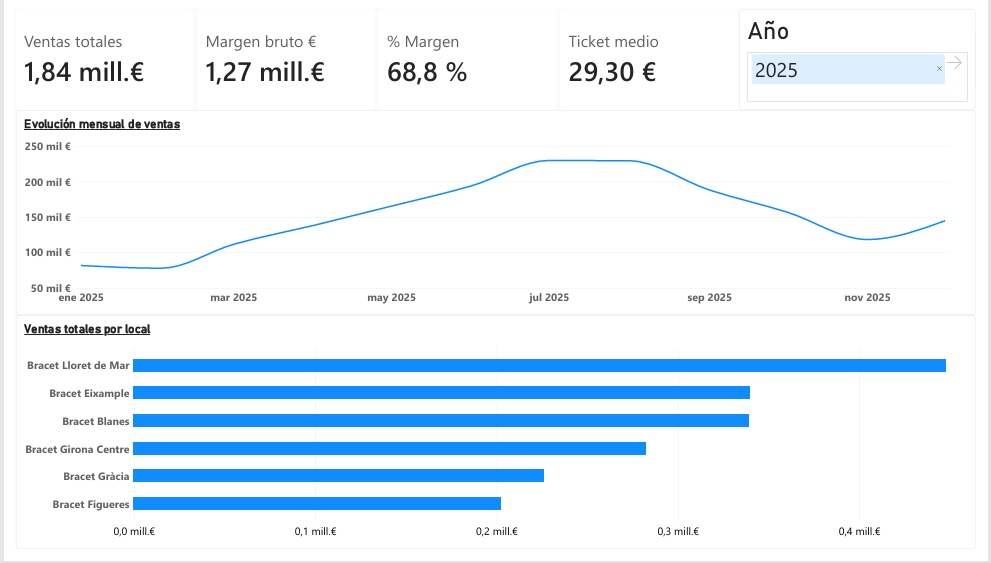
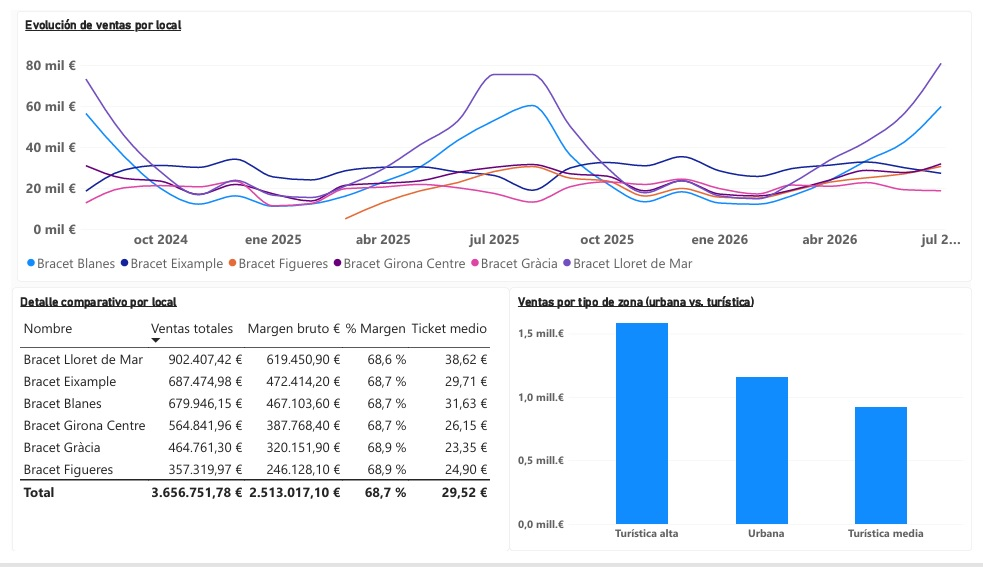
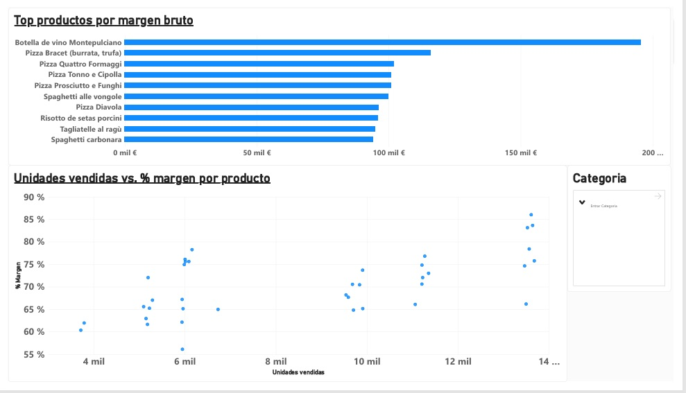
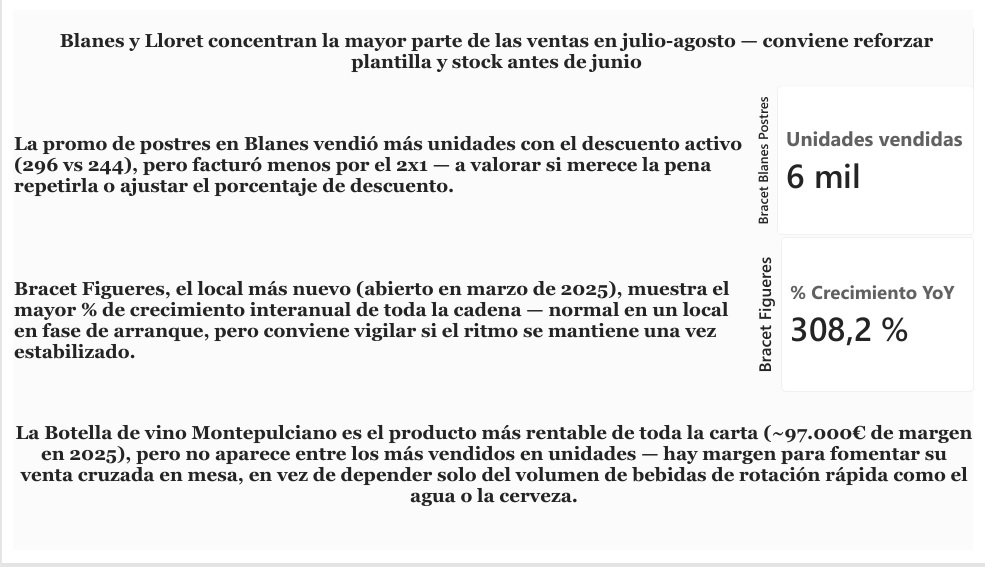

# 🍝 Bracet Trattoria — Dashboard de Ventas y Rentabilidad

**Proyecto de portfolio: Excel → SQL → Power BI**
Análisis de ventas, márgenes y estacionalidad de una cadena ficticia de 6 restaurantes italianos en Barcelona y la Costa Brava, con 24 meses de histórico (ago 2024 – jul 2026).

---

## 🎯 El problema de negocio

Bracet Trattoria tiene dos tipos de local muy distintos bajo la misma marca: restaurantes urbanos en Barcelona con demanda estable todo el año, y restaurantes en la Costa Brava con fuerte estacionalidad turística. La dirección necesita un dashboard único que permita:

- Comparar el rendimiento real entre locales que operan en contextos muy diferentes.
- Detectar qué productos generan más margen, no solo más ventas.
- Anticipar la temporada alta para planificar plantilla y stock con tiempo.
- Medir si las promociones activas realmente compensan el descuento aplicado.

## 🛠️ Stack y proceso

| Fase | Herramienta | Qué se hizo |
|---|---|---|
| 1. Limpieza | Excel | Detección y resolución de duplicados, precios en blanco, unidades negativas e importes descuadrados sobre ~124.000 líneas de venta |
| 2. Modelado y análisis | SQL (SQLite) | Modelo relacional (locales, productos, ventas, promociones, costes de personal) + 16 consultas: agregaciones, evolución temporal, impacto de promociones, márgenes por local/producto |
| 3. Visualización | Power BI | Dashboard ejecutivo de 4 páginas con KPIs, comparativa entre locales, rentabilidad por producto e insights de negocio |

## 📊 El dashboard

### Resumen financiero
KPIs globales (ventas, margen, ticket medio) y evolución mensual de ventas, con el pico de temporada alta claramente visible entre junio y agosto.



### Comparativa por local
Evolución de ventas local a local y desglose de zona urbana vs. turística — los locales de costa disparan sus ventas en verano mientras los urbanos se mantienen estables.



### Rentabilidad por producto
Ranking de productos por margen bruto y relación entre volumen vendido y % de margen, para identificar qué se vende mucho pero deja poco, y viceversa.



### Insights y recomendaciones
Página final con lecturas de negocio accionables, no solo gráficos.



## 💡 Insights clave

- **Estacionalidad marcada en costa**: Blanes y Lloret concentran la mayor parte de la facturación en julio-agosto, lo que sugiere reforzar plantilla y stock antes de junio en vez de reaccionar durante la temporada alta.
- **La promoción no siempre gana**: la campaña 2x1 de postres en Blanes vendió más unidades con el descuento activo (296 vs. 244), pero facturó menos que el periodo posterior sin promoción — un caso real de que "más unidades" no siempre significa "más beneficio".
- **Figueres crece rápido pero desde una base pequeña**: el local más nuevo (abierto en marzo de 2025) muestra el mayor crecimiento interanual de la cadena (+308%), coherente con estar en fase de arranque; habrá que ver si el ritmo se sostiene una vez estabilizado.
- **El producto más rentable no es el más vendido**: la botella de vino Montepulciano genera el margen más alto de toda la carta (~97.000 € en 2025) pero no está entre los productos más vendidos en unidades — hay recorrido para fomentar su venta cruzada en mesa en vez de depender solo de bebidas de alta rotación.

## 📁 Estructura del repositorio

```
├── data/
│   ├── raw/            → fact_ventas.csv (datos originales, sin limpiar)
│   └── clean/           → Ventas_Limpio.csv + dim_*.csv
├── sql/
│   └── Consulta_Bracet_trattoria.sql
├── powerbi/
│   └── Dashboard_trattoria_Bracet.pbix
├── db/
│   └── bracet_trattoria.db
├── assets/               → capturas del dashboard
├── README.md             → documentación técnica del dataset
└── README_proyecto.md    → este archivo
```

## 🔗 Sobre mí

Guillermo Soler — en transición hacia analítica de datos, con 7 años de experiencia previa en gestión de cocina y pastelería en hostelería (KPIs de coste, stock y ventas aplicados ahora a herramientas de datos).

- GitHub: [github.com/GuilleSoler2](https://github.com/GuilleSoler2)
- LinkedIn: [linkedin.com/in/guillermo-soler](https://linkedin.com/in/guillermo-soler)
